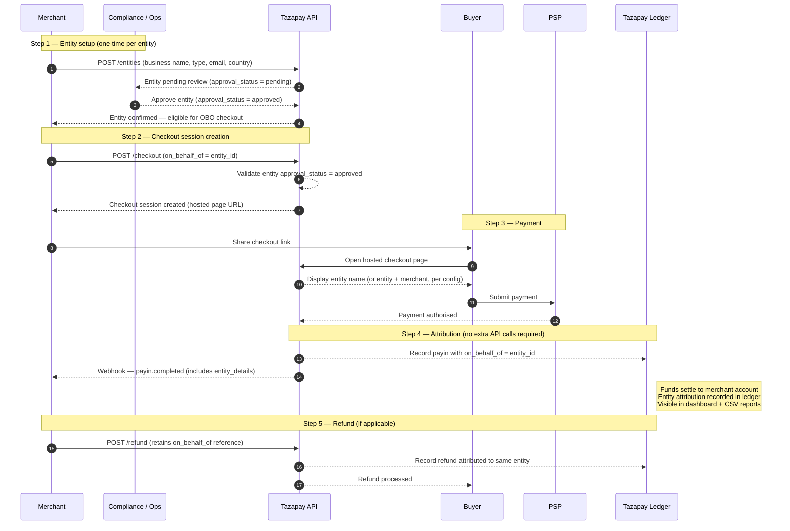

# Checkout OBO — Fund Flow

---

## How it works (plain language)

A merchant registers an entity (e.g. a seller, a remittance agent) inside their Tazapay account. Compliance reviews and approves the entity. The merchant then creates a checkout session with `on_behalf_of = entity_id`. When the buyer pays, the payin is attributed to that entity — not just to the merchant account. No new rails, no new settlement windows. OBO is a pure attribution layer on existing infrastructure.

---

## Party definitions

| Party | Who they are |
|---|---|
| **Buyer / Payer** | The end user making the payment |
| **Merchant** | Tazapay's direct customer — a marketplace, aggregator, remittance platform, or financial services provider |
| **Entity** | A sub-merchant registered under the merchant — a seller, MTO, remittance agent, wallet provider, etc. |
| **Tazapay** | Processes the payment; attributes it to the entity on the merchant's instruction |
| **PSP** | Underlying payment processor (unchanged from standard checkout flow) |

---

## Fund flow diagram



---

## What changes vs standard checkout

| | Standard Checkout | Checkout OBO |
|---|---|---|
| Who creates the session | Merchant | Merchant (on behalf of entity) |
| `on_behalf_of` field | Not present | Required (if config is ON) or optional |
| Payin attribution | Merchant account | Entity (under merchant account) |
| Entity approval gate | Not applicable | Default ON — entity must be approved before checkout creation |
| Funds settlement | Merchant account | Merchant account (entity attribution in ledger) |
| Webhook payload | Standard payin fields | Includes `entity_details` (ID, name, email, reference ID) |
| Hosted page display | Merchant name | Entity name, or entity + merchant (configurable) |
| Refund | Standard | Retains `on_behalf_of` entity reference |

---

## Config states and their effect

```
Merchant account config

┌─────────────────────────────────────────────────────────────┐
│ Mandatory entity approval required for checkout (default ON) │
│                                                             │
│  ON  → entity.approval_status must = "approved"             │
│        before checkout session creation is allowed          │
│                                                             │
│  OFF → checkout creation allowed for any entity,            │
│        regardless of approval status                        │
└─────────────────────────────────────────────────────────────┘

┌─────────────────────────────────────────────────────────────┐
│ Mandatory OBO information for checkout (default ON)          │
│                                                             │
│  ON  → on_behalf_of field is required on every              │
│        checkout session for this merchant account           │
│                                                             │
│  OFF → on_behalf_of is optional — merchant can mix          │
│        OBO and non-OBO checkout sessions                    │
└─────────────────────────────────────────────────────────────┘
```

---

## Entity types and risk tier (for Compliance and Licensing reference)

```
Lower regulatory complexity ────────────────────► Higher regulatory complexity

  Commerce              Remittance              Financial Services
  ─────────             ──────────              ──────────────────
  Seller                MTO                     Wallet Provider
  Merchant              Remittance Agent         Mobile Money Operator
  Vendor                Subagent                 Telecom
                                                 Utility Biller
```

---

## Key data fields added to payin events

```json
{
  "payin_id": "...",
  "merchant_id": "...",
  "on_behalf_of": "entity_abc123",
  "entity_details": {
    "entity_id": "entity_abc123",
    "business_name": "Acme Seller Ltd",
    "email": "seller@acme.com",
    "reference_id": "merchant-assigned-ref",
    "entity_type": "seller"
  }
}
```
