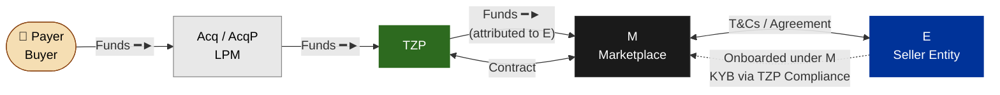
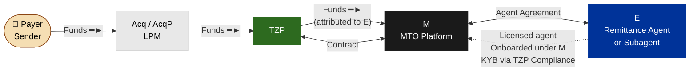
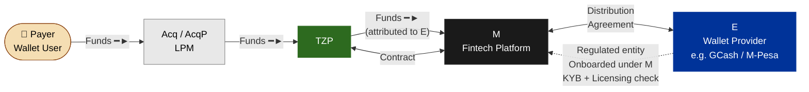
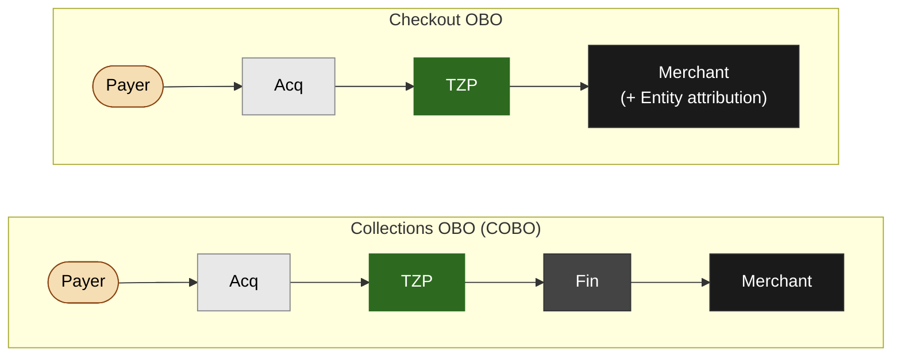

# Checkout OBO — Model Flows

---

## Legend

| Arrow | Meaning |
|---|---|
| `━━━━►` | Funds flow |
| `◄━━━►` | Contract / commercial agreement |
| `- - -►` | Onboarding relationship |

**Parties**

| Label | Full name | Role |
|---|---|---|
| **Payer** | Buyer / Sender | End user making the payment |
| **Acq / LPM** | Acquirer / Local Payment Method | Underlying payment processor or rail |
| **TZP** | Tazapay | Processes checkout; records payin; attributes funds to entity |
| **M** | Merchant | Tazapay's direct client — marketplace, MTO, fintech platform, etc. |
| **E** | Entity | Sub-merchant registered under the merchant — seller, MTO, wallet provider, remittance agent, etc. |

---

## What's the same in all scenarios

- Funds always flow: **Payer → Acq/LPM → TZP → Merchant account**
- TZP contracts directly with the Merchant (not the Entity)
- Entity is **attributed** in the payin ledger — it does not receive funds directly from TZP
- The Merchant is responsible for any downstream settlement or payout to the Entity (separate flow, outside Checkout OBO scope)
- Entity must be approved by Compliance before checkout creation is allowed (when default config is ON)

---

## Scenario 1 — Commerce / Marketplace

**Situation:** Tazapay has onboarded a marketplace platform as a Merchant. The platform creates checkout sessions on behalf of its seller entities (individual stores or vendors). Funds are collected by the Merchant; sellers are attributed in the payin record and reconciled separately by the Merchant.

**Key points for this scenario**
- The buyer sees the seller entity name on the hosted checkout page (configurable)
- The payin record in TZP ledger includes `on_behalf_of = entity_id` and `entity_details`
- M receives settlement; M is responsible for paying out to each seller (separate payout flow)
- Compliance approves each seller entity before M can create OBO checkouts for them
- Risk: chargeback and fraud monitoring must operate at entity level, not just merchant level

---

## Scenario 2 — Remittance / Money Transfer

**Situation:** Tazapay has onboarded a remittance platform as a Merchant. The platform creates checkout sessions on behalf of its network of licensed remittance agent entities. The payer is a sender; the entity is the remittance agent who receives the attribution (the ultimate beneficiary is outside Tazapay's scope).

**Key points for this scenario**
- Remittance agent entities (MTOs, subagents) are in a regulated activity category — Licensing must confirm TZP's licence covers processing attributed to these entity types in each jurisdiction
- SAR/STR filing logic must map correctly when entity and merchant are different legal entities
- TM rules must segment activity by entity, not just merchant — MTO entity types represent higher-risk corridors
- The ultimate beneficiary (recipient of the remittance) is outside TZP's flow — TZP's attribution ends at the entity level

---

## Scenario 3 — Financial Services / Wallet Topup

**Situation:** Tazapay has onboarded a fintech platform as a Merchant. The platform enables users to topup third-party wallet accounts — e.g., GCash, M-Pesa — where each wallet provider is registered as an entity under the Merchant account.

**Key points for this scenario**
- Wallet providers (GCash, M-Pesa, etc.) are themselves regulated entities — Licensing must confirm no regulatory conflict in processing checkout sessions attributed to them
- This is the highest-risk scenario from a licensing perspective: the entity is a regulated financial institution in its own jurisdiction
- Compliance sign-off required per entity type before enabling for live merchants

---

## Checkout OBO vs Collections OBO (COBO) — structural comparison

| | Collections OBO (COBO) | Checkout OBO |
|---|---|---|
| **TZP contracts with** | Financial intermediary (Fin) | Merchant directly |
| **Merchant relationship** | Merchant contracts with Fin, not TZP | Merchant contracts with TZP directly |
| **Entity layer** | Merchant is the entity (sub-merchant of Fin) | Entity is registered under the Merchant |
| **Settlement chain** | Payer → Acq → TZP → Fin → Merchant | Payer → Acq → TZP → Merchant (entity attributed) |
| **Who onboards entities** | Fin onboards Merchants | Merchant onboards Entities (KYB via TZP Compliance) |
| **Number of contract layers** | TZP ↔ Fin, Fin ↔ Merchant | TZP ↔ Merchant, Merchant ↔ Entity |

**The key structural difference:** In COBO, there is a financial intermediary between TZP and the Merchant. In Checkout OBO, TZP contracts directly with the Merchant — the Entity layer is internal to the Merchant's account structure, not a separate contracting party with TZP.

---

## What Checkout OBO does NOT cover

| Out of scope | Notes |
|---|---|
| Settlement / payout to Entity | Separate payout flow — the Merchant is responsible for distributing funds to entities downstream |
| Beneficiary receipt (remittance) | The end beneficiary receiving the remittance is outside TZP's flow |
| Entity-level FX | FX operates at the Merchant account level |
| New payment rails | OBO is attribution only — no new PSPs, acquirers, or rails introduced |
